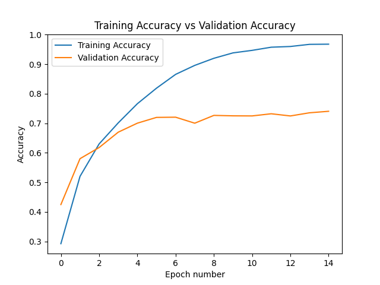
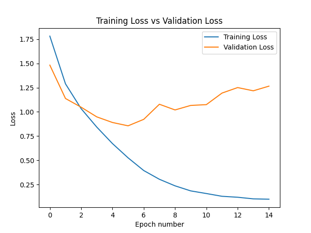
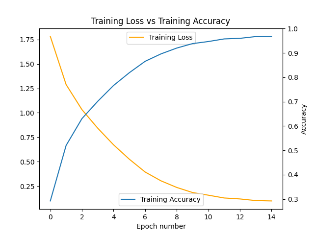
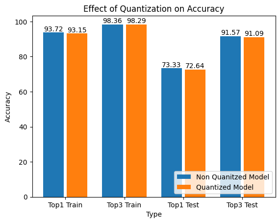
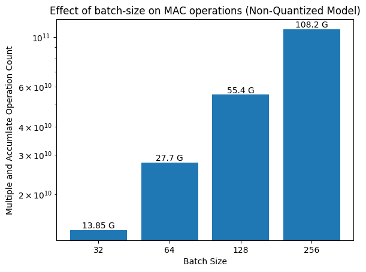
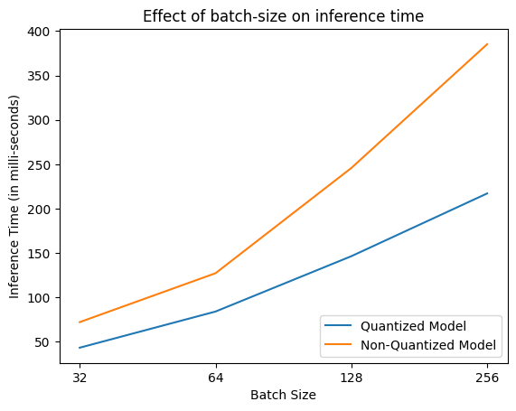

## Effect of Post Training Quantization on VGG16 trained using CIFAR-10 dataset.

- This contains results for the VGG16 model quantization, SmallNet quantization has it's own report in the current directory.

### Plots showing the effect of training VGG16 model using the parameters from config.yaml on CIFAR-10 dataset.

<figure>

  
  <b><figcaption>Accuracy Plot</figcaption></b>

</figure>

<figure>

<b><figcaption>Loss Plot</figcaption></b>

  

</figure>

<figure>

  
  <b><figcaption>Accuracy vs Loss Plot</figcaption></b>
  

</figure>

- To not overfit the model, terminate within 20 epochs, based on the [hyperparameter](config.yaml) that are provided.
- Not finetuning the model to improve the accuracy and reduce the loss, as it's not the scope of this work.

### Effect of quantization on accuracy of the VGG16 model.

| Model           | Parameter Count | Model Size (MB) | Top1 Train Accuracy | Top3 Train Accuracy | Top1 Test Accuracy | Top3 Test Accuracy |
| --------------- | --------------- | --------------- | ------------------- | ------------------- | ------------------ | ------------------ |
| VGG16           | 134301514       | 537.218         | 93.722%             | 98.362%             | 73.33%             | 91.57%             |
| Quantized VGG16 | 134301514       | 134.361         | 93.148%             | 98.288%             | 72.64%             | 91.09%             |

<figure>
  

  
  

</figure>

- We can observe that on applying quantization on model there is a slight reduction in accuracy.

### Effect of quantization on VGG16 Model Size.

<figure>
  

  
  

</figure>

- We can see an reduction of ~4x in the model size when quantization is applied on the VGG16 model.

### Effect of quantization on MAC operations with varying batch-sizes.

<figure>
  

  
  

</figure>

- Increase in input batches (2x) during inference time, leads to an increase in the number of MAC (multiply-accumlate) operations (~2x) for non-quantized VGG16 model.

### Effect of quantization on models inference time with varying batch-sizes.

<figure>
  

  
  

</figure>

- We can observe that quantized model is faster in all the cases when compared to it's counterpart.
- As the batch-size increases the difference between the inference time for quantized vs non-quantized time also increasing.
